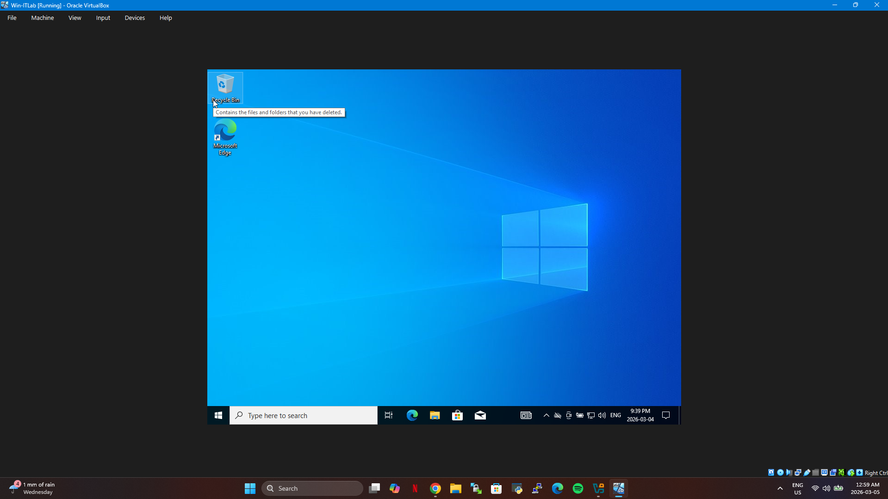
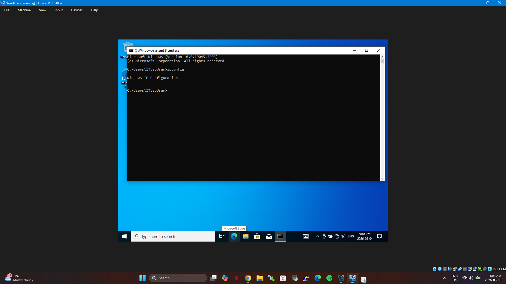
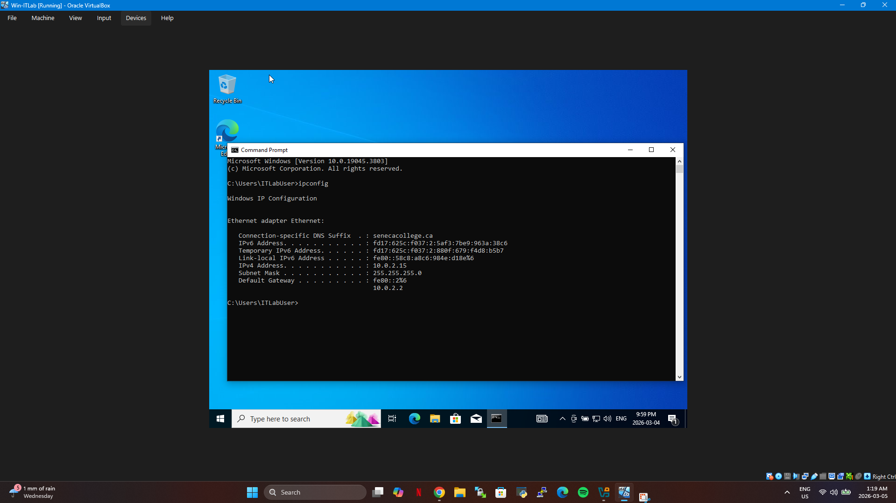
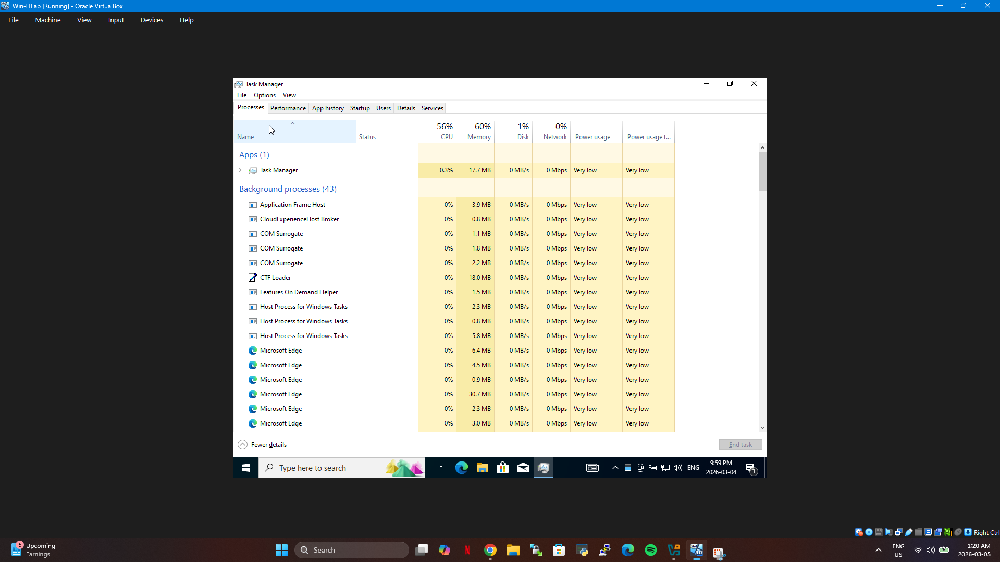
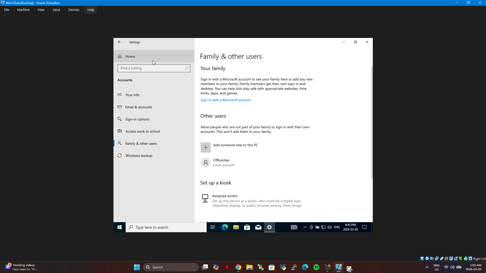

# IT Support Troubleshooting Home Lab

## Project Overview

This project demonstrates a virtual IT support troubleshooting environment created to simulate common technical issues encountered by help desk and IT support professionals.

The lab environment was designed using virtualization and Windows tools to diagnose and resolve system, network, and user account issues.

---

## Technologies Used

- Windows Virtual Machine
- System Diagnostics Tools
- Windows Networking Tools
- Command Prompt Utilities

---

## Lab Scenarios

### 1. Network Connectivity Issue
A simulated network problem was created where the system could not connect to the network.

Tools used:
- ipconfig
- ping
- network adapter settings

The issue was diagnosed and resolved by correcting network configuration settings.

---

### 2. System Diagnostics
System performance and configuration were examined using built-in Windows diagnostic tools.

Tools used:
- Task Manager
- System Information
- Command Prompt

---

### 3. User Account Management
User account settings and permissions were reviewed to simulate common help desk support scenarios.

---

## Skills Demonstrated

- Windows troubleshooting
- Network diagnostics
- Command line tools
- Problem identification and resolution
- IT support workflow

---

## Screenshots

### Windows Virtual Machine Environment

### Network Issue Investigation

### Network Issue Resolved

### System Diagnostics

### User Account Management

